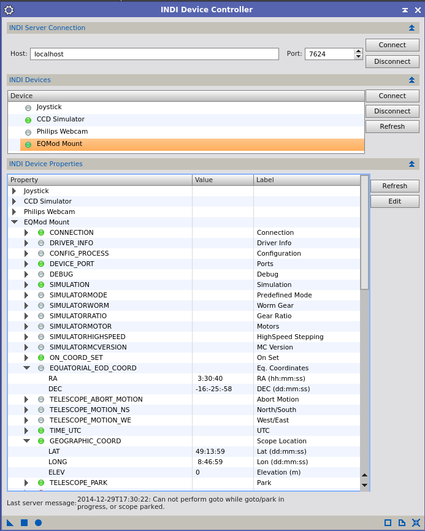
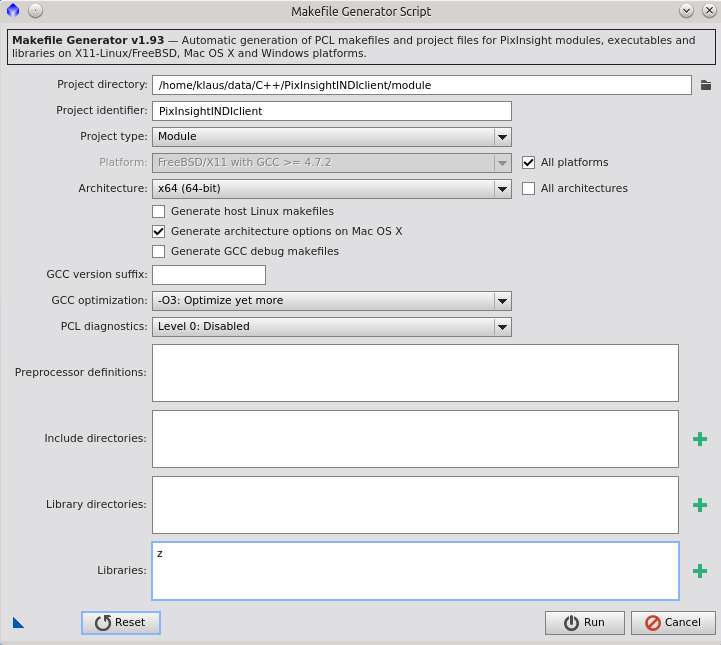
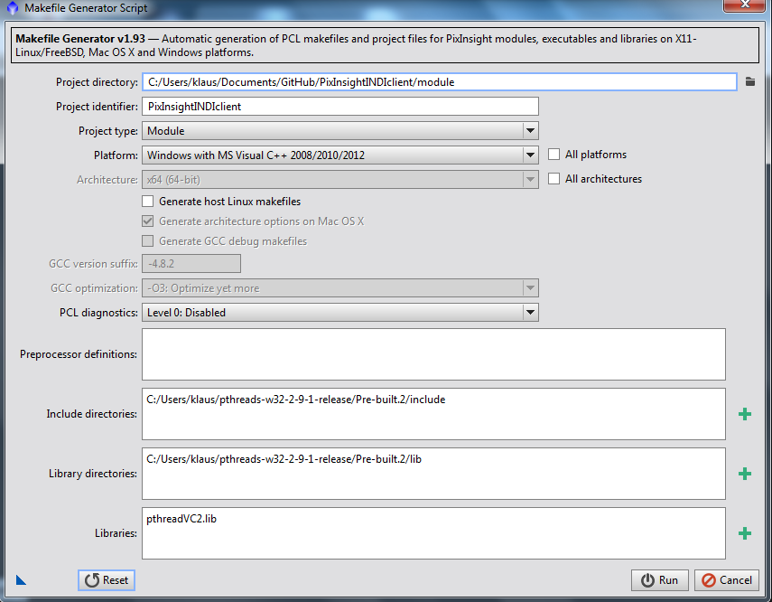

PixInsight INDI Device Controller
=================================

PixInsight INDI Device Controller is an INDI controller client for the image processing platform [PixInsight](http://pixinsight.com/).
Using the [INDI technology](http://www.indilib.org/), it allows to control astronomical devices like telescope mounts, 
CCD cameras, filter wheels, DSLRs from PixInsight.    

Installation
------------
The client can be installed as a regular PixInsight module. To build the module from sources use the PixInsight Makefile Generator script with the 
following settings (for all Linux and MacOS): 

And for windows builds:

